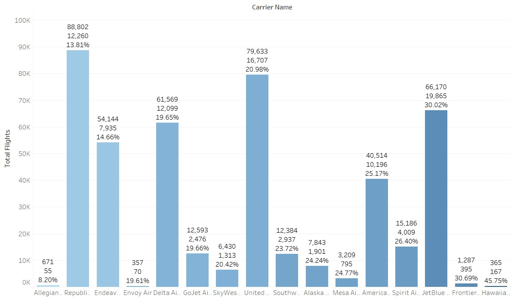

# ✈️ NewYork_Flight_Delay_Analysis (2014–2023)
This project analyzes historical flight delay data from New York’s major airports of 10 year time period between January 2014 and December 2023. It was developed as part of the MSc Big Data Analytics program at Sheffield Hallam University and presented under SHU Consultancy.

## Data Source  
U.S. Bureau of Transportation Statistics (2014–2023)

## 🔍 Project Overview
Flight delays are a significant operational challenge for airports and airlines. This project explores temporal trends, root causes, and airport-level patterns in flight delays to support data-informed decision-making for improving efficiency and passenger satisfaction.

# 🎯Business Questions
1.What are the average flight delays between 2014 and 2023 across the three airports?
2.During which months do delays peak, and what seasonal patterns exist?
3.What are the most common causes of delays?
4.How do different airports compare in terms of delay trends and contributing factors?
5.Which airlines have the least delay for flights arriving at New York airports in the year 2023?

# 🛠️ Tools & Methodologies
Tools & Technologies:
-**Python** – Extracted raw flight delay data and saved it locally.
-**WinSCP** – Used to transfer files from the local system to Hadoop Sandbox (HDP).
-**Command Line Interface (CLI)** – Managed file movement in HDFS and accessed SparkR/Hive environments.
-**HDFS** – Used for staging and storing raw datasets.
-**R and Apache Spark** – Cleaned, pre-processed, and transformed data for DataMart development.
-**Apache Hive** – Created star schema tables (fact/dimension) and performed analytical queries.
-**Tableau** – Connected to Hive to create dashboards and visualizations to answer business questions.
Methodologies:
-Exploratory Data Analysis (EDA)
-Time-based aggregation (yearly, monthly)
-Delay classification and pattern recognition
-Comparative airport analysis
 
# 📊 Key Insights
-Larger airlines like Republic manage delays better than smaller carriers, suggesting room for operational improvement.
-Winter (Jan–Feb) and Summer (Jun–Jul) showed peak delay months, reflecting seasonal impacts.
-Top causes of delays included carrier-related issues, weather, and late-arriving aircraft.
-Data visualization helped simplify complex temporal patterns and communicate actionable insights effectively.

# Results & Insights

## Flight Delays by Airline
  
*Insight: Smaller regional airlines showed higher delay rates, while major carriers maintained more consistent performance.*

## Seasonal Delay Trends
  
*Insight: Summer months consistently showed the highest delays, largely due to weather and air traffic congestion.*

## Delay Causes Breakdown
  
*Insight: Weather (39%) and NAS issues (21%) were the top drivers of delays, suggesting resource allocation during adverse conditions could reduce disruptions.*

## Impact of Time of Day
  
*Insight: Evening flights had significantly higher delays compared to morning departures, highlighting the cumulative impact of congestion throughout the day.*

# 👥 Team Contributions
-Data Engineering: Data extraction, HDFS setup, Hive schema design.
-Data Analysis: Cleaning, transformation, and EDA using Spark and -R.
-Visualization: Dashboard creation in Tableau and insights storytelling.
-Presentation: Delivered findings in a consultancy-style presentation deck.

# 📁 Project Files
-NewYork_Flight_Delay_Analysis_Appendix.pdf – Detailed methodology, data structure, and EDA documentation
-NewYork_Flights_Delay_Analysis.pptx – Executive presentation summarizing project insights and recommendations

# 🌟 Takeaways
-A well-designed EDA can reveal deep operational patterns without advanced forecasting.
-Leveraging distributed tools like Spark and Hive enhances data scalability and performance.
-Business-friendly dashboards are essential for translating analytics into decision support.

# 📌 About Me
I'm a recent MSc Data Analytics graduate with experience in data storytelling, operational analysis, and team-based projects. I’m passionate about turning raw datasets into meaningful insights.
📫 [Connect with me on LinkedIn](www.linkedin.com/in/bhumika-hanumantharaya ) 

#  📌 View the Project
- 📄 [Appendix PDF](https://drive.google.com/file/d/1452v1jmtj9ZEGUhbE8gaejx8ixe8Yglm/view?usp=drive_link)
- 📊 [Presentation Slide](https://docs.google.com/presentation/d/1mf8w9lCGUvnwICWlJiQRD0NhzkQamd4m/edit?usp=drive_link&ouid=104797347104586255676&rtpof=true&sd=true)

